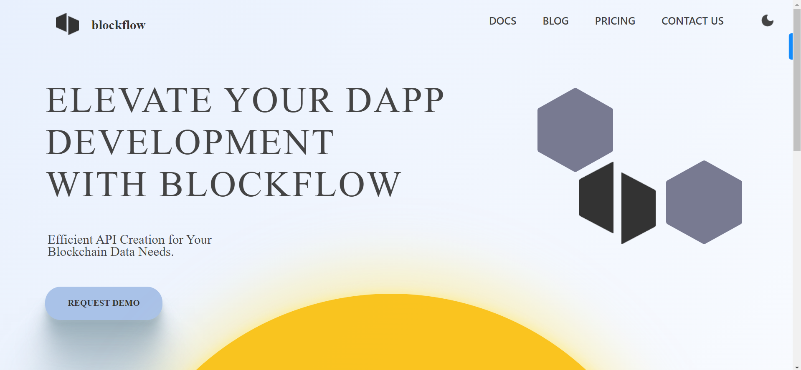

# Blockflow Assignment



This project was completed as part of the Software Development Engineer (SDE) Internship assignment at Blockflow. The assignment primarily focused on creating interactive animations and implementing custom CSS styles to enhance the user experience.

## Key Features

- Utilized animations and custom CSS to create visually appealing interfaces.
- Implemented a custom hook to seamlessly switch between light mode and dark mode, enhancing user comfort.
- Highlight of the assignment was the Eclipse Transformation Animation, showcasing the ability to create complex animations.
- Assignment demonstration video is available in the `src/assets` directory for reference.

## Preview

[](https://drive.google.com/file/d/1lK7Q79VylMSDvDo8yb4FRhAeHt__4rQ4/view?usp=sharing)

## Deployment

The project is deployed and accessible online. You can view the live demo by following this [deployment link](https://aryan-prog.github.io/blockflow-assignment/).

## Getting Started

1. Clone the repository:

   ```bash
   git clone https://github.com/aryan-prog/blockflow-assignment.git
   ```

2. Install dependencies:

   ```bash
   cd blockflow-assignment
   npm install
   ```

3. Start the development server:

   ```bash
   npm start
   ```

4. Open your browser and navigate to `http://localhost:3000` to see the project in action.

## Technologies Used

- React
- CSS animations
- Custom Hooks

## Contact

For any inquiries or feedback, please contact me via email: seth.aryan605@gmail.com
